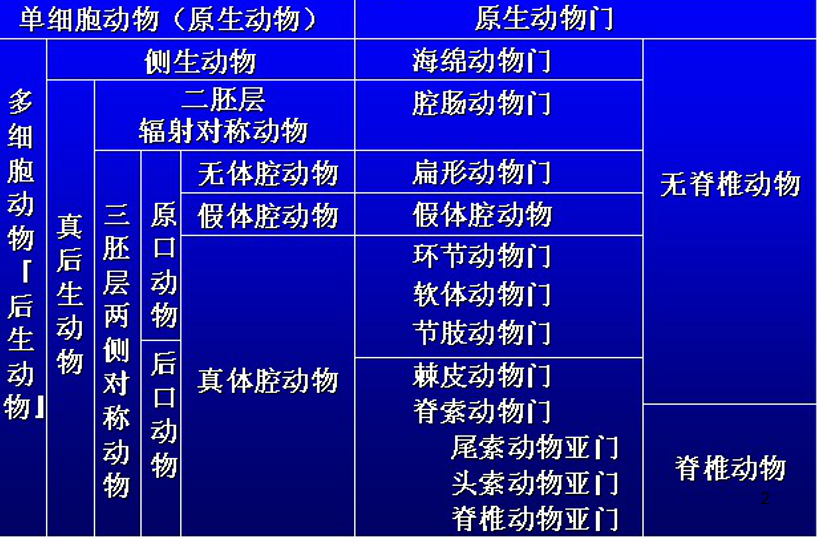
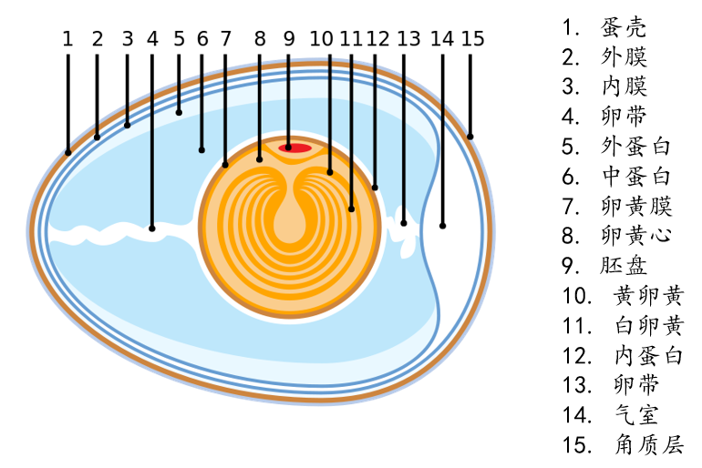

# 概括

## 进化事件

## 对称方式

* 无对称
    * 腹足类身体扭转、比目鱼成鱼
* 辐射对称
    * 两条辐射对称
    * 五条辐射对称
* 两侧对称

## 胚层

1. 无胚层
1. 两层细胞
1. 两层胚
1. 三层胚

## 体腔

1. 无体腔
1. 假体腔(囊胚腔)
1. 真体腔(中胚层)
1. 混合体腔(血腔)

## 分节现象

* 同律分节
    * 环节动物
* 异律分节
    * 节肢动物、脊索动物

## 原口和后口

|        原口动物        |              后口动物              |
| :--------------------: | :--------------------------------: |
|        螺旋卵裂        |              辐射卵裂              |
|    内胚层来自端细胞    |    内胚层来自体腔(脊椎动物除外)    |
| 体腔由中胚层带开裂形成 | 体腔由体腔囊融合形成(脊椎动物除外) |
| 口来自原口，肛门后形成 |       肛门来自原口，口新形成       |

## 上下颚的形成

WIP

## 五趾型附肢

两栖类。

## 羊膜卵

## 恒温

鸟类、兽类动物维持体温恒定。

### 意义

* 促进了各种酶的活动，提高新陈代谢水平
* 提高了快速运动的能力
* 减少了对环境的依赖

## 胎生和哺乳

WIP