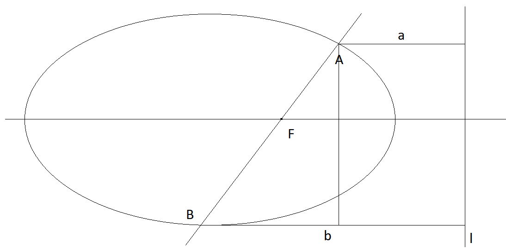

# 椭圆

## 椭圆的方程

$$ \frac{x^2}m+\frac{y^2}n=1,m>0,n>0,m\neq n $$

## 分类(焦点所在的轴)

* 焦点在x轴
  * $$ m>n>0,\begin{cases}m=a^2\\n=b^2\\c=m-n\end{cases} $$
  * 焦点为 $$ (c,0),(-c,0) $$
* 焦点在y轴
  * $$ n>m>0,\begin{cases}n=a^2\\m=b^2\\c=n-m\end{cases} $$
  * 焦点为 $$ (0,c),(0,-c) $$

## 椭圆的基本参数

* 长轴长
  * $$ |AB| = 2a $$
* 短轴长
  * $$ |CD| = 2b $$
* 焦点
  * 左焦点 $$ F_1(-c,0) $$
  * 右焦点 $$ F_2(c,0) $$
* 顶点
  * 左顶点 $$ A(-a,0) $$
  * 右顶点 $$ B(a,0) $$
  * 上顶点 $$ C(0,b) $$
  * 下顶点 $$ D(0,-b) $$
* 焦距
  * $$ |F_1F_2| = 2c $$
  * $$ c $$ 为半焦距
* 通径
  * 过一焦点做 $$ MN $$ 垂直于所在坐标轴，被椭圆截得线段 $$ MN $$
  * $$ |MN| = 2\frac{b^2}a =  2\frac ca \cdot \frac {b^2}c = 2ep $$
* 离心率( $$e$$ )
  * 描述椭圆性状(圆的还是扁的)
  * $$ e=\frac ca $$
  * $$ e \in (0,1) $$
* 准线
  * $$ \begin{cases} x=-\frac{a^2}c\\ x=\frac{a^2}c \end{cases} $$
* 焦准距( $$p$$ )
  * $$ p=\frac{a^2}c-c=\frac{b^2}c $$

## 椭圆的第一定义与焦点三角形

以椭圆上一点 $$ P $$ 与椭圆两个焦点 $$F_1,F_2$$ 为顶点的三角形，满足如下性质：

### 面积公式

$$ |PF_1| + |PF_2| = 2a $$

设 $$ PF_1 = x, PF_2 = y $$ 且夹角为 $$ \theta $$ 有

$$ \begin{cases} x+y=2a\\4c^2=x^2+y^2-2xy\cos\theta=(x+y)^2-2xy(1+\cos\theta)\end{cases} $$

$$ \Rightarrow 2b^2=xy(1+\cos\theta) $$

$$ S_{\triangle PF_1F_2} = \frac12xy\sin\theta = b^2\frac{\sin\theta}{1+\cos\theta}=b^2\cdot\tan{\frac\theta2}=c|y_p| $$

### 角度

$$ \theta_{max} \to S_{max} \to y_{pmax}$$

当 $$P$$ 与短轴重合时， $$\theta$$ 取最大值。且：

$$\sin{\frac{\theta_{max}}2}=\frac ac=e$$

### 离心率

$$\frac x{\sin \alpha}=\frac y{\sin \beta}=\frac{2c}{\sin\theta}$$

$$\Rightarrow \frac{x+y}{\sin\alpha+\sin\beta}=\frac{2c}{\sin\theta}$$

$$\Rightarrow e=\frac{\sin\theta}{\sin\alpha+\sin\beta}=\frac{\sin{(\alpha+\beta )}}{\sin\alpha+\sin\beta}$$

## 椭圆的第二定义

到定点(焦点)的距离与到定直线(准线)的距离之比为定比 $$ e $$ (离心率)的点的集合是椭圆。

### 焦半径公式

$$ r_{left}=a+ex $$

$$ r_{right}=a-ex $$

$$ r_{up}=a-ey $$

$$ r_{down}=a+ey$$

### 焦点弦比例

若过焦点 $$F$$ 的弦被焦点分为比例为 $$\lambda$$ 的两线段，则：

如图所示，过 $$A,B$$ 做 $$x$$ 轴平行线交准线于两点，过 $$A$$ 做 $$x$$ 轴的垂线。

设直线倾斜角为 $$\theta$$ ，$$AF=r,BF=\lambda r$$ ，则有：

$$\cos\theta=\frac{b-a}{r+\lambda r}$$

又 $$ a=\frac re,b=\frac{\lambda r}e $$

$$\Rightarrow e\cdot\cos\theta=\frac{1-\lambda}{1+\lambda}$$
